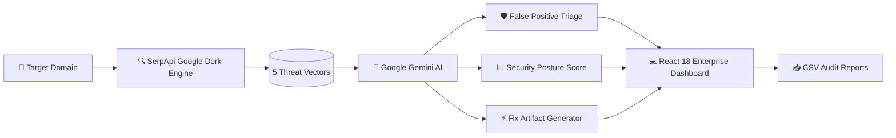

# 🛡️ BreachRadar — Autonomous AI Attack Surface Intelligence & Exposure Triage

[](https://fastapi.tiangolo.com)
[](https://react.dev/)
[](https://serpapi.com)
[](https://ai.google.dev/)
[](https://www.python.org/)
[](LICENSE)

> **Zero-touch, 100% passive external reconnaissance powered by SerpApi Google Search Intelligence and Google Gemini AI.**  
> Continuously discovers leaked environment secrets, database dumps, sensitive logs, and administrative interfaces—filtering search noise, scoring organizational risk, and generating instant DevSecOps remediation code.

---

## 💡 Why BreachRadar?

Traditional vulnerability scanners rely on intrusive, active port probes and packet injections that trigger Web Application Firewalls (WAFs), IP bans, and service interruptions.

**BreachRadar takes a 100% passive, zero-touch approach:**
1. **Zero Probes:** Queries global search engine indexes via **SerpApi** to mirror what threat actors can see on Google without touching the target's servers.
2. **AI Noise Elimination:** Employs **Google Gemini AI** to discard false alarms (documentation, tutorials, public blogs) and highlight verified leaks.
3. **Instant Remediation:** Generates copy-paste **Fix Artifacts** (Nginx rules, Apache directives, and `robots.txt` disallows) so engineering teams can patch exposures in seconds.
4. **Portfolio-Wide Surveillance:** Organizes multiple scanned domains into a unified **Multi-Domain Portfolio** with side-by-side posture benchmarking.

---

## 🏗️ Architecture & Pipeline



---

## ✨ Core Features

| Feature | Description |
| :--- | :--- |
| **🔍 100% Passive OSINT** | Scans 5 high-risk Google Dork categories without sending a single network packet to the target server. |
| **🧠 Gemini AI Triage** | Evaluates each raw link, severity rating (Critical to Informational), and separates actionable leaks from benign noise. |
| **📊 Security Posture Score (0–100)** | Mathematical resilience index derived from confirmed exposures: `100 - (Crit×30 + High×18 + Med×9 + Low×3)`. |
| **📝 CISO Threat Briefings** | Synthesizes complex multi-vector findings into authoritative, executive-ready risk assessments. |
| **⚡ Instant Fix Artifacts** | On-demand generation of Nginx block rules, Apache configurations, and robots.txt entries tailored to the exact leak. |
| **🌐 Multi-Domain Portfolio** | Side-by-side comparative posture bar charts and attack-surface inventory across all monitored digital assets. |
| **📥 Instant CSV Export** | Full client-side telemetry export containing URLs, severity ratings, AI risk assessments, and dork queries. |

---

## 🎯 Supported Reconnaissance Categories

| Category | Dork Signature Focus | Threat Vector |
| :--- | :--- | :--- |
| **Exposed Configs & Secrets** | `ext:env`, `ext:yml`, `ext:yaml`, `DB_PASSWORD`, `auth` | API keys, database credentials, JWT secrets |
| **Database Backups** | `ext:sql`, `ext:bak`, `ext:dmp`, `ext:backup` | Production database dumps, customer records |
| **Exposed Admin Portals** | `inurl:login`, `inurl:admin`, `inurl:dashboard` | Internal authentication gateways, CMS logins |
| **Sensitive Files & Logs** | `ext:log`, `error`, `password`, `exception` | Server stack traces, debug logs, error dumps |
| **Confidential Documents** | `filetype:pdf ("confidential" OR "internal use only")` | Proprietary blueprints, contracts, internal docs |

---

## 📁 Project Structure

```text
breachradar/
├── backend/                       # 🚀 FastAPI Backend & OSINT Intelligence Core
│   ├── main.py                    # REST API endpoints (/api/scan, /api/patch, /api/health)
│   ├── scanner.py                 # SerpApi Google Dork Reconnaissance Engine
│   ├── triage.py                  # Google Gemini AI Triage & Fix Artifact Generator
│   ├── requirements.txt           # Python dependencies
│   └── .env                       # Local API keys (SERPAPI_API_KEY, GEMINI_API_KEY)
│
├── frontend/                      # ⚡ React 18 + Vite SaaS Dashboard
│   ├── src/
│   │   ├── components/
│   │   │   ├── TopNav.jsx             # Search bar, reset scan action, target switcher
│   │   │   ├── Sidebar.jsx            # Operations navigation & scan pipeline tracker
│   │   │   ├── KpiRow.jsx             # Metric cards with embedded sparkline aesthetics
│   │   │   ├── AnalyticsSection.jsx   # CISO briefing banner & posture radial gauge
│   │   │   ├── FindingsTable.jsx      # Filterable tabular findings & inline fix drawer
│   │   │   ├── PortfolioAnalytics.jsx # Multi-domain comparative posture bar chart
│   │   │   └── IdleState.jsx          # Animated radar scanner with quick-target chips
│   │   ├── api.js                 # Axios/Fetch client & CSV report downloader
│   │   ├── App.jsx                # Root state coordinator with localStorage persistence
│   │   └── index.css              # Custom SaaS design system (no generic utilities)
│   ├── package.json               # Node dependencies
│   └── vite.config.js             # Vite development server configuration
│
├── scripts/                       # 🛠️ CLI Utilities & Test Scripts
│   ├── run_pipeline.py            # Headless terminal-based passive OSINT pipeline test
│   └── verify_connection.py       # SerpApi connection validator
│
├── streamlit/                     # 📊 Legacy Streamlit Python Prototype
│   └── app.py                     # Standalone Streamlit dashboard
│
├── .gitignore                     # Git ignore rules for Python, Node, and secrets
└── README.md                      # Project documentation
```

---

## 🚀 Quick Start Guide

### Prerequisites
* **Python 3.10+**
* **Node.js 18+** & `npm`
* API Keys:
  * [SerpApi API Key](https://serpapi.com) (for Google Dork search results)
  * [Google Gemini API Key](https://aistudio.google.com) (for AI triage and remediation generation)

---

### 1. Environment Configuration

Create a `.env` file inside `backend/`:
```env
SERPAPI_API_KEY=your_serpapi_key_here
GEMINI_API_KEY=your_gemini_api_key_here
```

---

### 2. Start the FastAPI Backend (Terminal 1)

```powershell
cd backend
pip install -r requirements.txt
uvicorn main:app --reload --port 8000
```
* **API Endpoints:** `http://127.0.0.1:8000`
* **Interactive API Docs (Swagger UI):** `http://127.0.0.1:8000/docs`

---

### 3. Start the React Web Dashboard (Terminal 2)

```powershell
cd frontend
npm install
npm run dev
```
* **Web Dashboard:** `http://localhost:5173`

---

## 🧪 Safe Demo Benchmark Targets

You can test BreachRadar safely against official open testbeds:
* **`testphp.vulnweb.com`**: Acunetix vulnerable web testbed (demonstrates active admin logins and configuration exposures).
* **`juice-shop.herokuapp.com`**: OWASP Juice Shop official demo (modern SPA endpoints and token leaks).
* **`example.com`**: RFC 2606 standard baseline (demonstrates clean 100/100 posture resilience).

---

## 🔒 Security & Ethics Notice

> **BreachRadar adheres strictly to passive reconnaissance standards.**  
> It queries only public search engine caches and indexed Google search results via SerpApi. It sends **zero active network requests**, port probes, or intrusive packets to the target domain's infrastructure.

---

## 📄 License

This project is licensed under the **MIT License** — see the [LICENSE](LICENSE) file for details.
